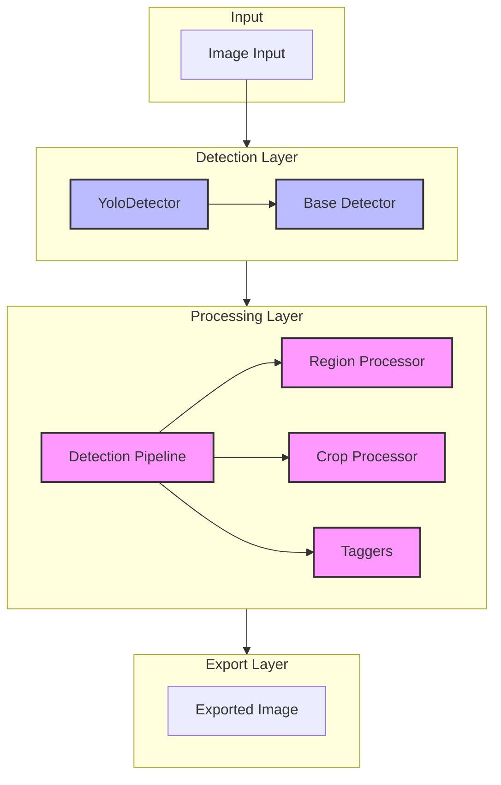

# Kalliste Processing Flow

```mermaid
flowchart TB
    subgraph Input
        I[Image Input]
    end

    subgraph Detection["Detection Layer"]
        YD[YoloDetector]
        BD[Base Detector]
        YD --> BD
    end

    subgraph Processing["Processing Layer"]
        DP[Detection Pipeline]
        RP[Region Processor]
        CP[Crop Processor]
        T[Taggers]
        
        DP --> RP
        DP --> CP
        DP --> T
    end

    subgraph Export["Export Layer"]
        EI[Exported Image]
    end

    I --> Detection
    Detection --> Processing
    Processing --> Export

    classDef processing fill:#f9f,stroke:#333,stroke-width:2px
    classDef detection fill:#bbf,stroke:#333,stroke-width:2px
    class YD,BD detection
    class DP,RP,CP,T processing
```

Note: This diagram represents an older version of the codebase that used Pixeltable. The current implementation uses ChromaDB.