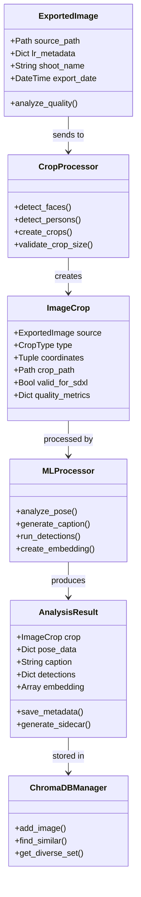

# Post-Export Processing Flow

This diagram shows the flow of image processing after export from Lightroom.

## Processing Steps

1. **ExportedImage**: Represents a PNG exported from Lightroom
   - Contains original metadata from Lightroom
   - Identifies shoot based on folder naming
   - Can run basic quality analysis if needed

2. **CropProcessor**: Handles detection and cropping
   - Detects faces and persons in the image
   - Creates appropriate crops
   - Validates crops against SDXL size requirements

3. **ImageCrop**: Represents a cropped version
   - Links back to source image
   - Contains crop coordinates and type
   - Tracks SDXL validity
   - Includes quality metrics for the crop

4. **MLProcessor**: Runs ML analysis on crops
   - Pose detection
   - Captioning
   - Custom detections
   - Embedding generation

5. **AnalysisResult**: Stores analysis results
   - Contains all ML processing results
   - Handles metadata storage
   - Generates training sidecar files

6. **ChromaDBManager**: Manages similarity database
   - Stores images and embeddings
   - Provides similarity search
   - Helps create diverse training sets
