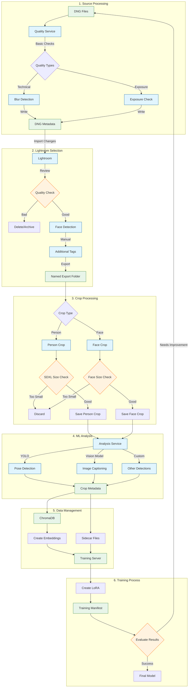

# Kalliste Workflow

## Core Processing Pipeline

## Workflow Overview

1. **Source Processing**: Basic quality checks on DNG files
   - Blur detection
   - Exposure checks
   - Write results to DNG metadata

2. **Lightroom Selection**: Manual curation and enhancement
   - Review quality check results
   - Face detection
   - Manual tagging
   - Export selected images

3. **Crop Processing**: Automated cropping for training
   - Person crops with SDXL size validation
   - Face crops with size validation
   - Discard undersized crops

4. **ML Analysis**: Process cropped images
   - Pose detection
   - Image captioning
   - Custom detections
   - Store metadata with crops

5. **Data Management**: Prepare for training
   - Add to ChromaDB with embeddings
   - Generate sidecar files
   - Transfer to training server

6. **Training Process**: Create and evaluate LoRA
   - Train model
   - Generate manifest
   - Evaluate results
   - Iterate if needed
