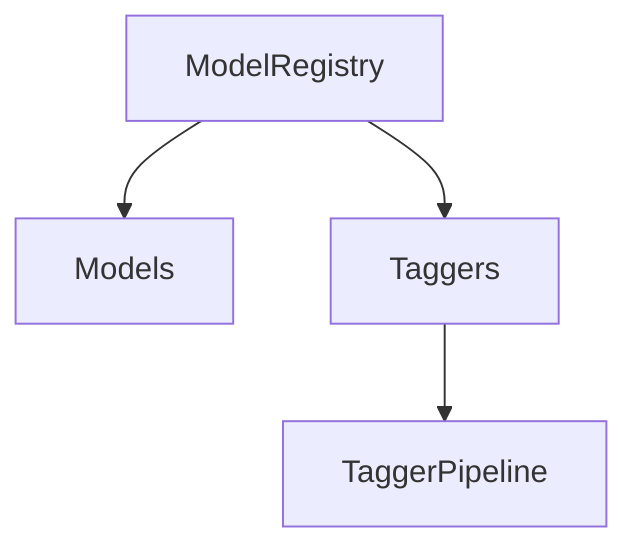
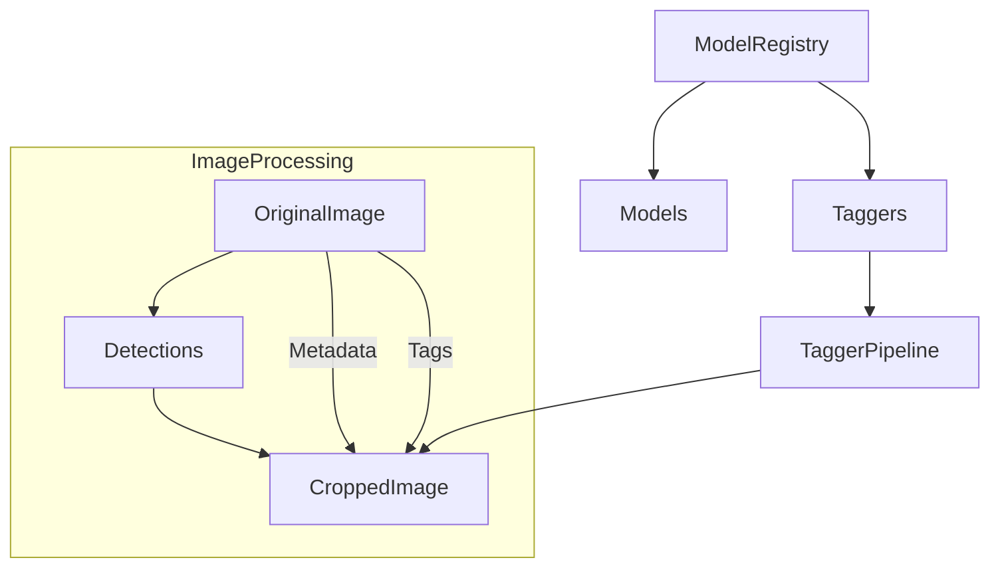

# Current Development State with Claude

## Recent Updates

### 12/24/2024 - Metadata and Image Processing Overhaul
- Implemented metadata inheritance from OriginalImage to CroppedImage
- Created ExifTool config for Kalliste namespace
- Fixed image format handling in CroppedImage
- Added file operation synchronization

### Current Implementation Status
- Model Registry and Tagger pipeline working
- Basic detection flow established
- Metadata inheritance chain working
- Custom namespaces defined for tags

### Known Issues
1. ExifTool timing issues
   - Temp file conflicts
   - Command ordering sensitivity
   - Need proper file synchronization
2. Image format stability
   - PNG CRC errors occurring
   - Need robust format handling
3. WD14 initialization still needs work
   - Model loading timing issues remain

### Next Steps
1. Clean up exiftool command handling
2. Implement robust file operation ordering
3. Add format verification before tagging
4. Complete metadata inheritance chain

## Architecture Evolution

**Previous State:**


**Current State:**


## Implementation Details

### Metadata Flow
1. OriginalImage processes file
2. Creates initial Kalliste tags
3. Spawns CroppedImage with:
   - Reference to original file
   - Initial tag set
   - Detection info

### CroppedImage Processing
1. Crops and saves image
2. Runs taggers through pipeline
3. Inherits metadata from original
4. Adds new Kalliste tags

### ExifTool Implementation
- Custom namespace defined
- Metadata copying with exclusions
- Tag injection with proper ordering
- Format-specific handling

### Image Processing
- Proper file synchronization
- Format validation
- Error recovery options
- Device-specific optimizations

## Current Focus
Stabilizing the metadata and file operation flow, particularly around the ExifTool operations and image format handling. The architecture is now properly structured for metadata inheritance, but timing and synchronization issues need to be resolved.

## Reference

### ExifTool Command Structure
Commands must follow this order:
1. exiftool command
2. -config option
3. -overwrite_original
4. Other options
5. File paths

### Kalliste Tag Structure
```xml
<Kalliste:Tag>category:value</Kalliste:Tag>
<Kalliste:TagSource>source_name</Kalliste:TagSource>
<Kalliste:TagConfidence>0.95</Kalliste:TagConfidence>
```