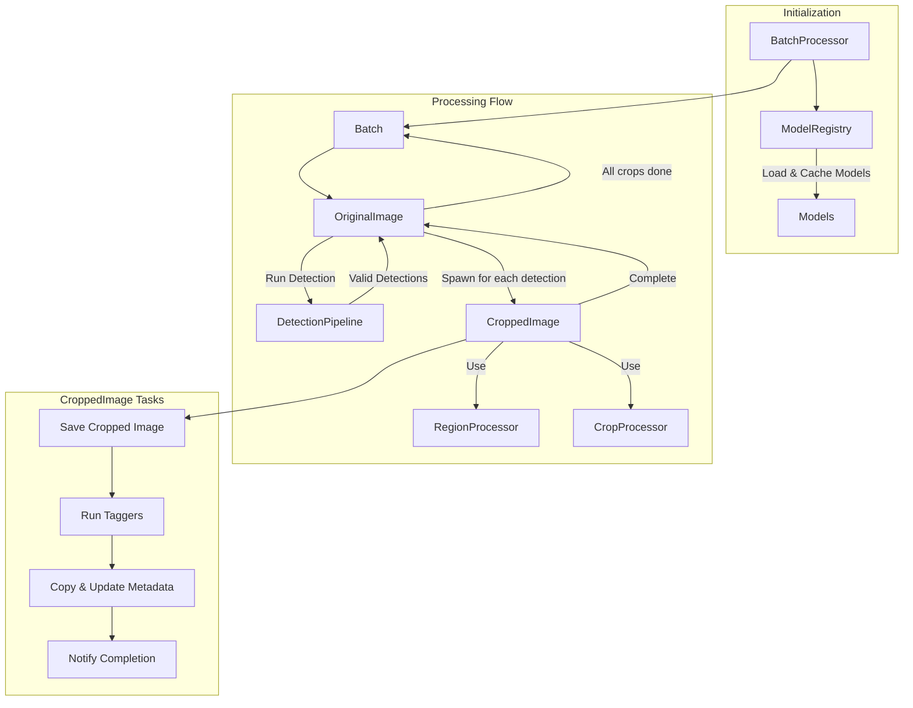

# Kalliste System Architecture Documentation

## Overview

Kalliste is a batch image processing system designed to detect, crop, and tag regions of interest in images, optimizing them for use with Stable Diffusion XL (SDXL). The system uses YOLO-based detection, ML-based tagging, and sophisticated region processing to create high-quality training data.

## Core Processing Flow



## Component Responsibilities

### BatchProcessor
- Initializes the processing pipeline
- Manages ModelRegistry initialization
- Processes input directories sequentially
- Creates Batch instances as needed

### ModelRegistry
- Loads and caches ML models at startup
- Provides model access throughout processing
- NOT an orchestrator - purely a model provider
- Handles:
  - YOLO detection models
  - BLIP2 captioning
  - WD14 tagging
  - Orientation classification

### Batch
- Legacy component managing folder-level processing
- Creates OriginalImage instances for each image
- Tracks completion of image processing

### OriginalImage
- Manages the processing lifecycle of a single image
- Initiates DetectionPipeline processing
- Creates CroppedImage instances for valid detections
- Tracks completion of all crops
- Notifies Batch upon completion

### CroppedImage
- Manages individual detection processing
- Utilizes RegionProcessor and CropProcessor services
- Responsibilities:
  1. Save cropped image
  2. Run ML taggers
  3. Copy metadata from original
  4. Inject new tags into metadata
  5. Notify completion and cleanup

### Supporting Services

#### DetectionPipeline
- Performs initial person/face detection
- Validates basic detection confidence thresholds
- Returns valid detections to OriginalImage

#### RegionProcessor
- Service used by CroppedImage
- Processes regions to meet SDXL requirements
- Applies type-specific padding:
  - Faces: 40% horizontal, 50% vertical
  - Persons: 15% horizontal, 10% vertical
- Ensures SDXL aspect ratio compliance
- Validates minimum size requirements

#### CropProcessor
- Service used by CroppedImage
- Handles actual image cropping operations
- Manages file naming and storage
- Creates both full-res and SDXL versions

## SDXL Requirements

Standard SDXL dimensions and ratios:
```python
SDXL_DIMENSIONS = [
    ((1024, 1024), (1, 1)),      # Square
    ((1152, 896), (9, 7)),       # Landscape
    ((896, 1152), (7, 9)),       # Portrait
    ((1216, 832), (19, 13)),     # Landscape
    ((832, 1216), (13, 19)),     # Portrait
    ((1344, 768), (7, 4)),       # Landscape
    ((768, 1344), (4, 7)),       # Portrait
    ((1536, 640), (12, 5)),      # Landscape
    ((640, 1536), (5, 12))       # Portrait (iPhone)
]
```
- All crops must meet minimum dimensions
- Aspect ratios must match SDXL standards
- Padding must maintain subject context

## File Organization

### Directory Structure
```
output_dir/
├── full_res/
│   └── original_face_0_crop.png
│   └── original_person_0_crop.png
├── sdxl/
│   └── original_face_0_crop_sdxl.png
│   └── original_person_0_crop_sdxl.png
```

### Naming Convention
- Format: `{original_filename}_{type}_{number}_crop.png`
- Examples:
  ```
  photo_face_0_crop.png
  photo_face_1_crop.png
  photo_person_0_crop.png
  ```
- SDXL versions append "_sdxl"

## Metadata Handling

### Original Metadata Preservation
- EXIF data copying
- ICC profile preservation
- Original camera data retention

### Kalliste Metadata Structure
```xml
<Kalliste:Tag>category:value</Kalliste:Tag>
<Kalliste:TagSource>source_name</Kalliste:TagSource>
<Kalliste:TagConfidence>0.95</Kalliste:TagConfidence>
```

### Processing Tags
- Detection information
- Crop specifications
- ML model outputs
- SDXL optimization parameters

## Error Handling and Logging

### Validation Points
- Pre-detection image validation
- Post-detection size requirements
- SDXL aspect ratio compliance
- Metadata integrity checks

### Logging Hierarchy
- Component-level logging
- Processing stage tracking
- Error reporting with context
- Performance metrics

### Recovery Strategies
- Partial batch processing
- Individual image retry logic
- Graceful degradation options

## Configuration System

### Global Settings
- Model paths and configurations
- Processing thresholds
- Device preferences
- Output specifications

### Per-Type Configurations
- Face-specific settings
- Person-specific settings
- Type-specific ML configurations

## Development Notes

### Current Process Flow
1. Original image stays in input directory
2. For each valid detection:
   - Create full-resolution crop
   - Save with original metadata
   - Run ML taggers
   - Create SDXL version
   - Add Kalliste metadata

### Critical Requirements
1. Size validation before processing
2. Unique filename generation
3. Proper SDXL ratio matching
4. Complete metadata preservation