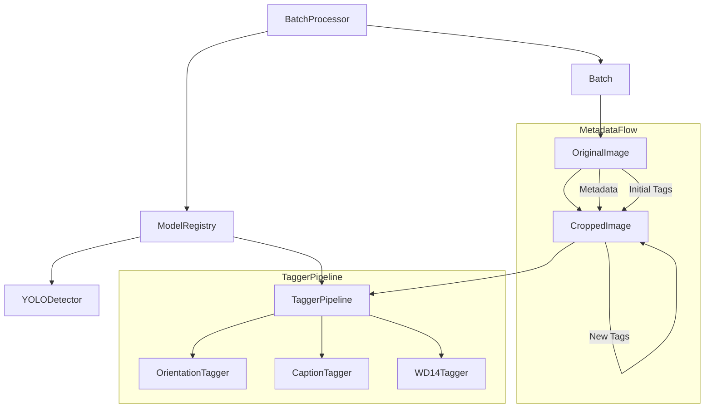
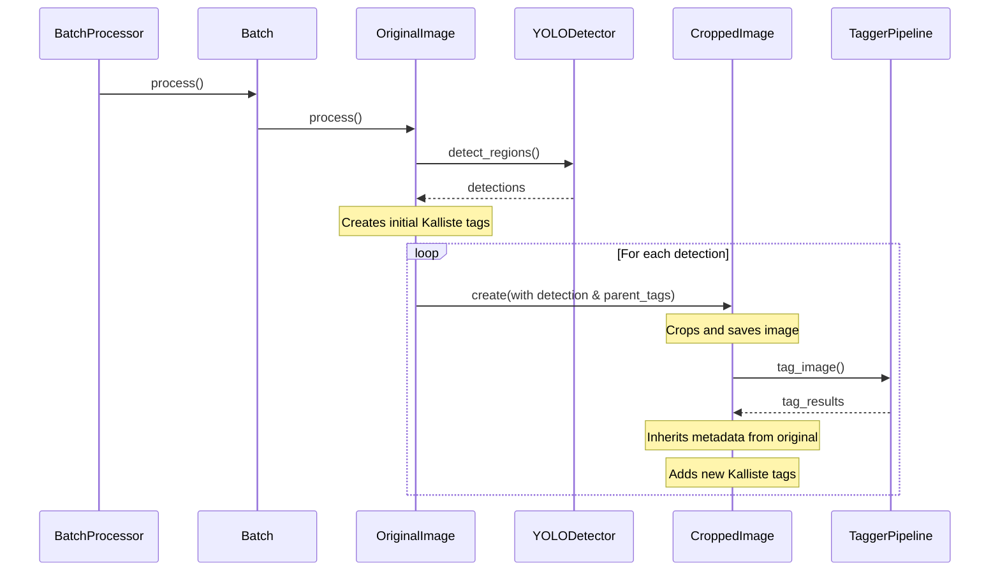

# Kalliste System Architecture Documentation

## Overview

Kalliste is a batch image processing system designed to detect, crop, and tag regions of interest in images. The system uses a combination of YOLO-based detection and various ML models for tagging and classification.



## Core Components

### BatchProcessor
The primary orchestrator that:
- Scans input directories for batches of images
- Manages the initialization of all models through ModelRegistry
- Coordinates the processing of batches
- Handles cleanup and resource management

### ModelRegistry
Central manager for all ML models that:
- Initializes models once at startup
- Provides access to initialized models throughout the system
- Ensures models are properly shared and reused
- Handles model cleanup on shutdown

### YOLODetector
Handles detection of regions of interest:
- Uses YOLOv8 for primary detection
- Supports face and person detection
- Configurable confidence thresholds and aspect ratios
- Outputs standardized Detection objects

### TaggerPipeline
Coordinates multiple tagging models:
- Manages tagger initialization and lifecycle
- Routes images to appropriate taggers based on detection type
- Combines and standardizes tagger outputs
- Handles type-specific configurations (e.g., face vs person tagging requirements)

### Individual Taggers

#### OrientationTagger
- Determines image orientation (portrait, landscape, etc.)
- Uses custom model for orientation detection
- Outputs confidence scores for each orientation possibility

#### CaptionTagger
- Generates natural language descriptions of images
- Uses BLIP2 model for captioning
- Handles device-specific optimizations (CPU/MPS/CUDA)

#### WD14Tagger
- General purpose image tagging
- Large vocabulary of potential tags
- Category filtering and confidence thresholds
- Content safety filtering

## Image Processing Flow



### Metadata and Tag Flow

1. OriginalImage Processing:
   - Loads image and runs detections
   - Creates initial Kalliste tags for the image
   - Spawns CroppedImage instances with:
     - Reference to original file
     - Initial tag set
     - Detection information

2. CroppedImage Processing:
   - Creates crop using detection bounds
   - Saves cropped image to disk
   - Runs taggers on cropped image
   - Copies metadata from original
   - Inherits parent tags
   - Adds new tags from:
     - Cropping operation
     - Tagger results

## Model Loading Strategy

Models are loaded once at startup through ModelRegistry:
1. YOLO models for detection
2. Orientation classification model
3. BLIP2 model for captioning
4. WD14 model for general tagging

Each model is:
- Loaded into appropriate device (CPU/MPS/CUDA)
- Initialized with optimal settings for the device
- Shared across all processing instances
- Properly cleaned up on shutdown

## Device Handling

The system handles multiple compute devices:
- CUDA for NVIDIA GPUs
- MPS for Apple Silicon
- CPU fallback for compatibility

Device-specific optimizations:
- WD14 always runs on CPU
- BLIP2 uses 8-bit quantization on CUDA
- MPS compatibility mode for certain operations

## Metadata Handling

Images preserve metadata through processing:
- EXIF data copied from originals to crops
- Kalliste-specific tags added via XMP namespace
- Tag hierarchy and organization preserved
- Original camera data maintained

### Kalliste Tag Format
```xml
<Kalliste:Tag>category:value</Kalliste:Tag>
<Kalliste:TagSource>source_name</Kalliste:TagSource>
<Kalliste:TagConfidence>0.95</Kalliste:TagConfidence>
```

### ExifTool Command Structure
Commands must follow this order:
1. exiftool command
2. -config option (must be first)
3. -overwrite_original
4. Other options
5. File paths

## Configuration System

Flexible configuration at multiple levels:
- Global settings in config.py
- Per-model configurations
- Type-specific tagger settings
- Runtime adjustable parameters

## Error Handling

Robust error handling throughout:
- Graceful degradation on tagger failures
- Batch-level error recovery
- Detailed logging and error reporting
- Resource cleanup on failures

## Logging

Comprehensive logging system:
- Hierarchical loggers matching component structure
- Debug-level details for development
- Info-level progress reporting
- Error details with tracebacks
- Rich console formatting