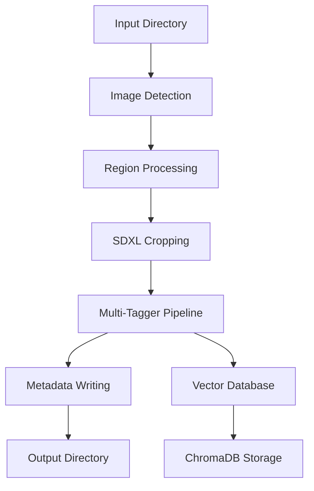
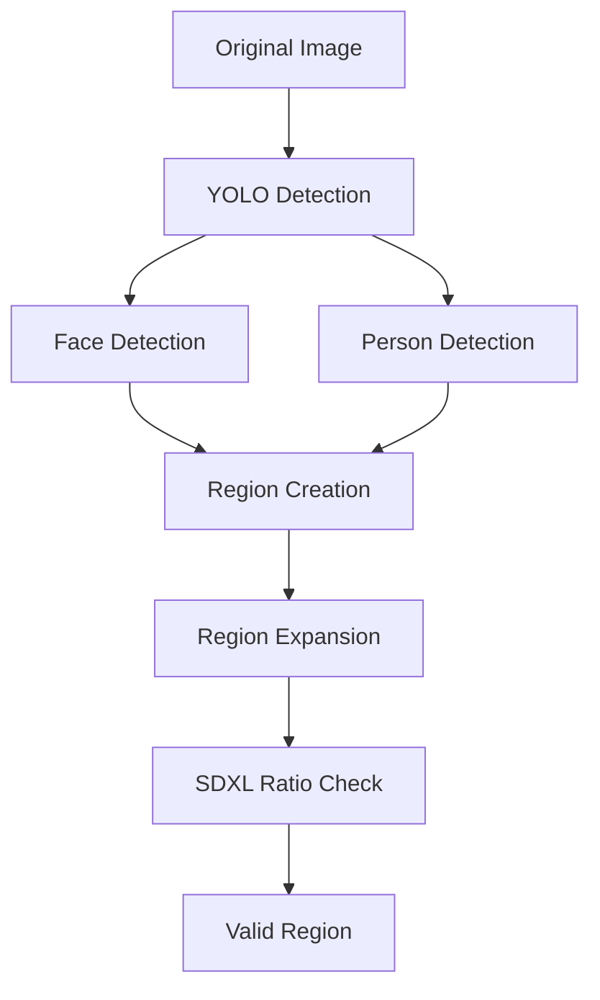
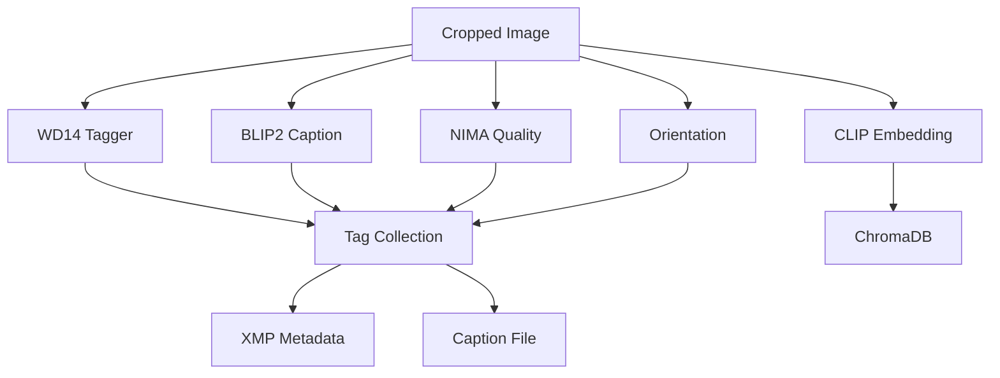
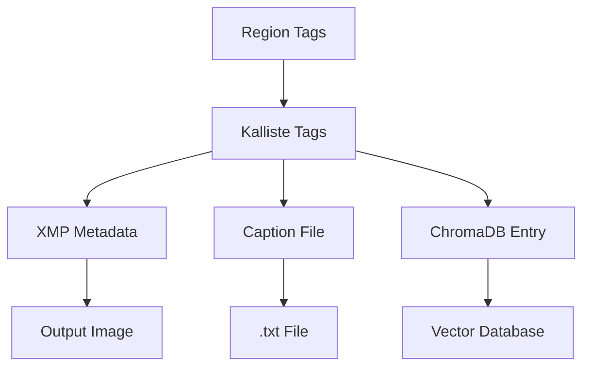
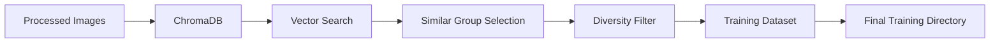
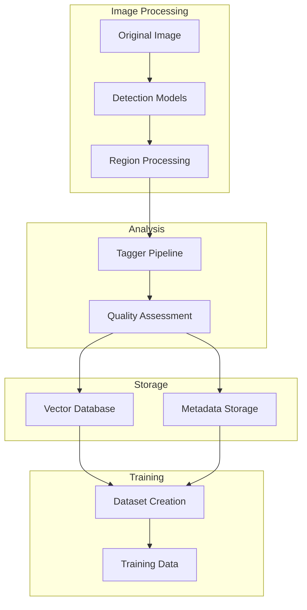

# Kalliste Architecture Overview

## Core Processing Pipeline

The main Kalliste pipeline processes images in several stages:

## Detection and Region Flow

## Tagger Pipeline

## Metadata Flow

## Training Data Preparation

## Component Relationships

## Key Components

- **Detection**: Uses YOLO models for initial detection of regions of interest
- **Region Processing**: Handles expansion, ratio correction, and validation
- **Tagger Pipeline**: Multiple models for analysis and metadata generation
  - WD14: Image classification and tagging
  - BLIP2: Caption generation
  - NIMA: Quality assessment
  - Orientation: Pose/view detection
  - CLIP: Vector embeddings
- **Storage**:
  - Filesystem: Organized output directories with metadata
  - ChromaDB: Vector database for similarity search
  - XMP: Embedded metadata in images
- **Training Preparation**:
  - Vector similarity search
  - Diversity-based selection
  - Dataset organization

## Model Management

- Centralized model registry
- Asynchronous model loading
- Device optimization (CUDA/MPS/CPU)
- Cached model downloads
