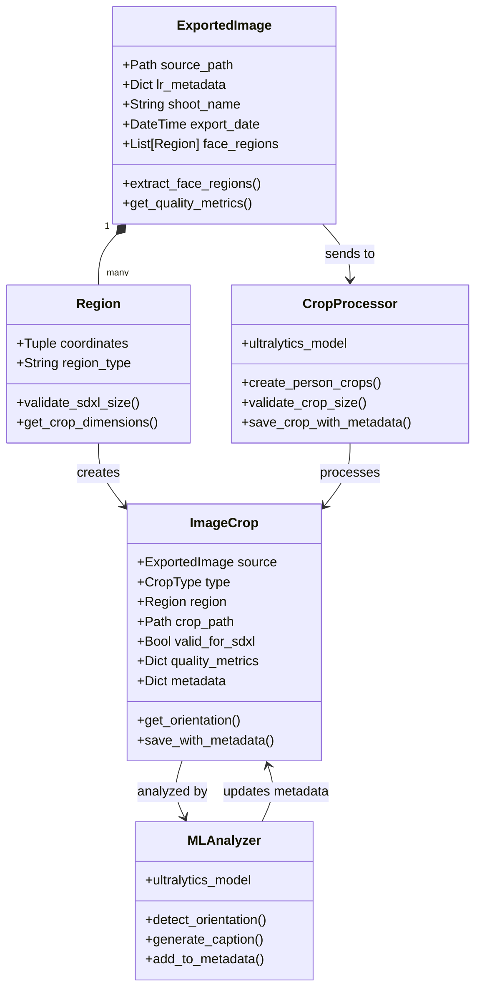

# Simplified Processing Flow

This diagram shows the core image processing flow, focusing on metadata preservation throughout the process.

## Processing Steps

1. **ExportedImage**
   - Handles reading of exported images from Lightroom
   - Extracts face regions from existing metadata
   - Gets basic quality metrics if needed

2. **Region**
   - Represents either a face region from Lightroom or a person crop
   - Validates if region meets SDXL size requirements
   - Provides dimensions for cropping

3. **CropProcessor**
   - Uses ultralytics for person detection
   - Creates and validates crops
   - Preserves metadata during crop creation

4. **ImageCrop**
   - Represents a processed crop with its metadata
   - Maintains link to source image
   - Handles saving crop with preserved metadata

5. **MLAnalyzer**
   - Detects orientation using ultralytics
   - Generates captions if needed
   - Adds analysis results to image metadata
